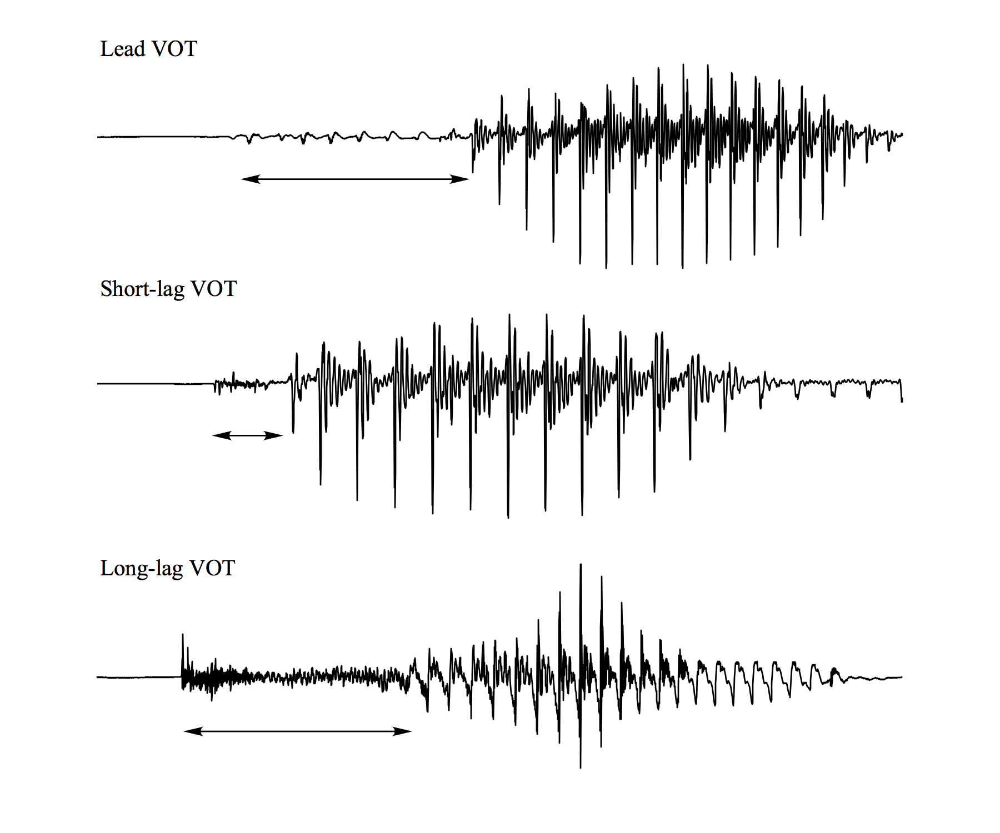
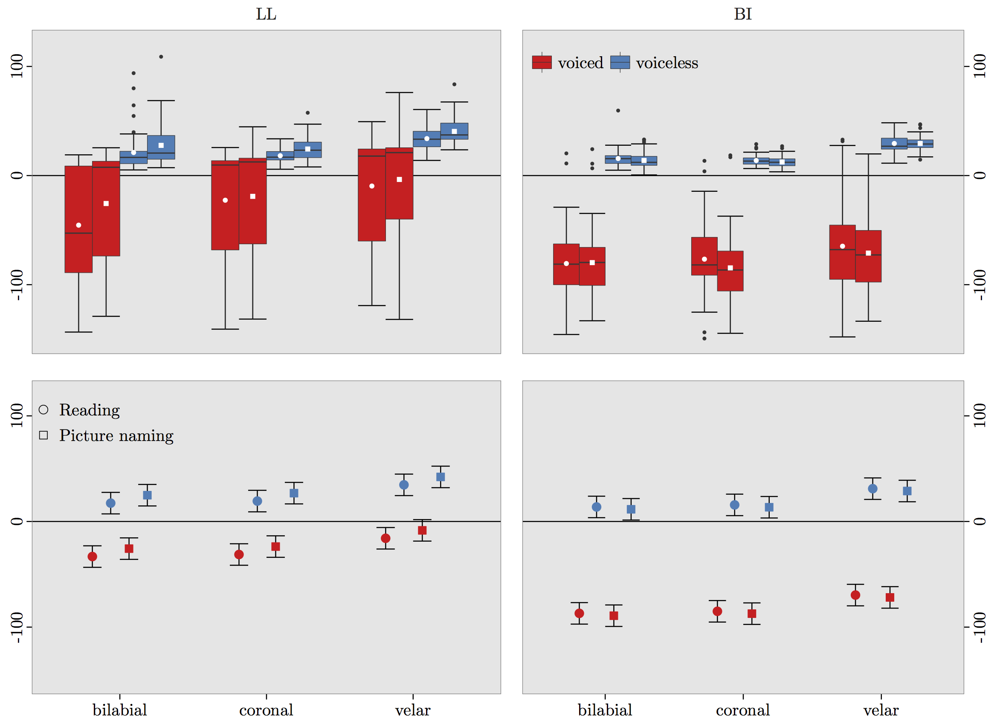

## Introduction

### Motivation

- Explore *what* and *how much* adults are capable of learning in optimal conditions 
context.
- Explore relationship between production/perception in early stages of L2 acquisition
- Explore how L2 categories develop over time

*** pnotes

- This project is concerned with the acquisition of second language phonology. 

---

## Introduction 

### Rationale

>- Sequential language learning has phonetic consequences (e.g. 
Flege et al., 1997; Pallier et al., 1997; Sebastián-Gallés & Soto-Faraco, 1999; 
among many others)
- Non-native accent retained, often after years of exposure to (and use of) L2
- Infants become 'attuned' to L1 sounds within first year of life (Bosch & Sebastián-Gallés, 2003; Kuhl et al., 1992)
- **Earlier is better**

---

## Introduction

### Late learners

>- L1/L2 cross-language interaction research suggests that native-like L2 ultimate 
attainment is difficult/uncommon
  - For both production/perception
  - Early sequential bilinguals (Pallier, Bosch, & Sebastián-Gallés, 1997; Sebastián-Gallés, Echeverría, & Bosch, 2005, among others)
- Grim outlook for most late learners (with exceptions) if native-like ultimate attainment is goal

---

## Introduction

### Advanced late learners

>- Some late learners do appear to be native-like, at least in some respects (Bongaerts, 1999)
- Multiple factors appear to be correlated with L2 mastery (Bongaerts, 1999)
  - Exposure to native input
  - Motivation
  - Phonetic/perceptual training
- Research by Flege suggests that native-like abilities associated with...
  - AOA/AOL
  - LOR
  - Access to native input
  - **L1**/**L2 use**

---

<div align="center">
  
</div>

---

</br></br></br>
<div align="center">
  
</div>

</br>

>- Accurately acquiring the stop contrasts of a foreign language can significantly improve foreign accent ratings (Sundara, Polka, & Baum, 2006)

*** pnotes

- the task of the L2 learner of Spanish is to associate short-lag VOT with Spanish voiceless /p, t, k/, 
- and create a new category altogether for lead VOT associated with voiced /b, d,
g/ in order to produce and perceive the Spanish stop contrasts accurately 

---

## Introduction

### Language acquisition contexts (Batstone, 2002)

> - *communicative context*: L2 learners use the TL in order to exchange information
> - <BLUE>learning context</BLUE>: input generally comes from a teacher, with special emphasis placed on attention to form (e.g. traditional classroom)
> - **immersion context** (e.g. study abroad, domestic immersion)

*** pnotes

- CC = often immigrants that are confronted with the task of learning the majority language in their linguistic environment. 
- LC = The latter group typically consists of high school or college students taking a foreign language class for credit towards a diploma or a degree. 
- SA = naturalistic communicative context with the added benefit of explicit instruction in a learning context.
- Classroom shows advantages for XXX
- SA shows advantages for XXX
- There is little work on acquisition of L2 phonology as a function of context
- This research aims to fill this gap

---

## Introduction

### At-home, SA

- Zampini (1998, 2001)
- Stevens (20XX)

---

## Introduction

### Research Questions

>1. Do late learners produce and **perceive** the fine phonetic detail of Spanish stops after a short-term immersion program?
2. At what point during the learning process do late learners begin to acquire a new, 
language-specific phonetic system? How much exposure is necessary for the acquisition 
of L2 fine phonetic detail?
3. What is the nature of the representations of the L2 sounds acquired in this context?
4. What is the temporal relationship between production and perception with regard 
to category formation? 
5. Do LLs shift between language specific perceptual systems?
6. What is the role of input with regard to accurately and efficiently acquiring a novel 
speech sound?

--- .segue bg:lightblue

<!-- 
#~~~~~~~~~~~~~~~~~~~~~~~~~~~#
# Overview                  #
#~~~~~~~~~~~~~~~~~~~~~~~~~~~#
-->

## Overview

</br>

1. Method
2. Production
3. Perception
4. Production/perception interface
5. Discussion/conclusion

--- .segue bg:grey


# Method

<!-- 
#~~~~~~~~~~~~~~~~~~~~~~~~~~~#
# Method                    #
#~~~~~~~~~~~~~~~~~~~~~~~~~~~#
-->

--- 

## Overview

### Participants

- Late learners (LL, n = 10)
- Simultaneous bilinguals (BI, n = 10)

### Questionnaires

- Demographic questionnaire (LL)
- Assessment questionnaire (LL)
- Bilingual Language Profile (BI)

### Experimental tasks

- Production (2)
- Perception (2)

---

## Domestic immersion program

### Middlebury College Language Schools

>- 7 week Summer immersion program (Middlebury, VT)
- Language Pledge
  - Formal agreement between the program and the student by which 
  the student promises to use only the target language throughout 
  the duration of the program.
  - Prohibits students from using English—or any language apart 
  from the one they are studying—for the course of the program.
- Live in residence halls with other students/professors/bilingual assistants.
- Everything in target language.

---

## Participants

### Late learners (LL)

>- 10 functionally monolingual American English speakers (4 males, 6 females)
- age: 23.7 y/o (sd = 5.27)
- Completed a demographic questionnaire describing their previous experience with Spanish.
- More than the equivalent of one semester of Spanish = excluded
- From all over the United States 
- Participated in 7-week at-home immersion Spanish program that took place during the Summer at a U.S. college campus. 

---

## Questionnaires

### Demographic questionnaire

- Administered on 1st day through google forms
- Age, sex, language history, travel history, parents languages, Spanish level

### Assessment questionnaire

- Administered at the beginning of every experimental session
- Self-reported...
  - time spent speaking Spanish/English
  - time spent speaking native/non-native speakers
  - speaking, listening and overall level in Spanish
  - sense of improvement
  - satisfaction with Spanish abilities
  - extracurricular activity participation

---

## Late learners

</br>

<div align="center">
  
</div>

---

<div align="center">
  
</div>

*** pnotes

- week 0 assessment all participants reported using Spanish 0% of the time and English 100% 
- LLs used English minimally, roughly 13.5% of the time  
- LLs reported interacting with native speakers 40.5% of the time, and with more proficient NNS 65.5% of the time.
- the LL group received high amounts of L2 input (though not entirely native input), and reported minimal L1 use. The weekly percentages for each participant are available in Appendix A.0.4. The LL groups self assessments of listening, speaking, and overall ability improved with increased exposure to Spanish. For example, on the first day of the program the LLs rated their speaking abilities as a 2.7 out of 10. After the final assessment this rating had increased to 5.4 out of 10. Figure 2.1 displays a radar plot summarizing the assessment data over the course of the program.

---

<div align="center">

```{r, results = 'asis', echo=FALSE, warning=FALSE, message=FALSE, fig.align='center', eval=TRUE}
library(dplyr); library(tidyr); library(googleVis)

questData <- structure(list(week = 0:6, spanTotal = c(0, 91, 87, 87, 88, 89, 
88), engTotal = c(100, 11, 11, 15, 10, 11, 23), spanNat = c(0, 
42, 37, 39, 40, 40, 45), spanNonNat = c(0, 60, 69, 66, 63, 63, 
62), spanBetter = c(0, 66, 70, 65, 69, 61, 62), spanWorse = c(0, 
24, 26, 26, 28, 23, 23), spanSame = c(0, 37, 40, 45, 43, 44, 
47), rateSpeak = c(2.7, 3.8, 4.2, 4.6, 5.5, 5.3, 5.4), rateUnderstand = c(4.9, 
5.7, 6, 5.8, 6.1, 6.6, 6.7), rateOveral = c(3.5, 4.7, 4.9, 5.1, 
5.2, 5.5, 5.8)), class = c("tbl_df", "tbl", "data.frame"), row.names = c(NA, 
-7L), .Names = c("week", "spanTotal", "engTotal", "spanNat", 
"spanNonNat", "spanBetter", "spanWorse", "spanSame", "rateSpeak", 
"rateUnderstand", "rateOveral"))

questData$date <- "2015-6-25"
questData[questData$week == 1, 'date'] <- "2015-7-1"
questData[questData$week == 2, 'date'] <- "2015-7-8"
questData[questData$week == 3, 'date'] <- "2015-7-15"
questData[questData$week == 4, 'date'] <- "2015-7-22"
questData[questData$week == 5, 'date'] <- "2015-7-29"
questData[questData$week == 6, 'date'] <- "2015-8-5"
questData$date <- as.Date(questData$date)

questData %>%
  select(., week, date, useSpan = spanTotal, useEng = engTotal, 
         speak = rateSpeak, understand = rateUnderstand, overall = rateOveral) %>%
  mutate(., speak = speak * 10, 
            understand = understand * 10, 
            overall = overall * 10) %>%
  gather(., key = var, value = value, -week, -date) -> test
  test$var <- as.factor(test$var)
  gvisMotionChart(test, idvar = "var", timevar = "date",
     options = list(width=1000, height=600)) %>% print(., tag = 'chart')

```

</div>

---

## Participants

### Simultaneous (native) bilinguals

- Control group
- Simultaneous Spanish/English bilinguals (n = 10) 
- Raised in Tucson, Arizona 
- Age: 23.3 (2.91)
- Use Spanish at home and with friends.
- Consider themselves fluent in both languages.
- Langauge dominance questionnaire (BLP)

---

## BLP (Birdsong, Amengual, Gertken, 2012)

- Bilingual Language Profile has four components: 
    - history (6 questions)
    - use (5 questions) 
    - competency (4 questions) 
    - attitudes (4 questions)
- Responses are numeric
    - score assigned to each language
        - Negative values = dominant in Spanish 
        - Positive values = dominant in English
        - Values close to 0 indicate balanced bilingualism 
        (mean = **7.63**; SD = **19.07**)

---

</br>
<div align="center">
  
</div>

---

## Tasks

- Production
  - Shadowing/Visual word recall administered weekly
  - Visual picture recall: administered post program
- Perception
  - 2AFC (a): ba/pa administered weekly
  - 2AFC (b): bafri/pafri administered post program in two sessions
- Metrics
  - **Response accuracy**
  - **VOT**
  - burst properties
  - vowel formants

---

## Experimental design

<p></p>
<div align="center">
  
</div>

--- .segue bg:grey


# Production

<!-- 
#~~~~~~~~~~~~~~~~~~~~~~~~~~~#
# Production                #
#~~~~~~~~~~~~~~~~~~~~~~~~~~~#
-->

---

## Overview

1. Longitudinal development of stop production
2. Semantic processing

---

## Method

1. one
2. two

---

<div align="center">
  
</div>

--- .segue bg:black

```{r, eval=TRUE, echo=FALSE}
df <- read.csv("./assets/scripts/prodDataGVIS.csv", header = TRUE, quote = "")
```

# Experiment 1
</br></br></br></br></br></br></br></br></br></br></br>
**Longitudinal development of stop production**

---

## Method

- one
- two [@praat]

---

## Results

- One
- Two

--- &twocol2 w1:60% w2:40%

*** {name: left}

<div style="float:left">
  
</div>

*** {name: right}

- Aspiration decreases as a function of time for voiceless stops
- Pre-voicing is incorporated into production of voiced stops

---

<div align="center">

```{r, results = 'asis', echo=FALSE, warning=FALSE, message=FALSE, fig.align='center', eval=TRUE}
library(dplyr); library(tidyr); library(googleVis)

df %>%
  spread(., group, vot) -> temp
temp$week <- as.Date(temp$week)
mPlot1 <- gvisMotionChart(temp, idvar = "phon", timevar = "week", 
     color = "voicing", yvar = "midd", 
     options = list(width=1000, height=600))
print(mPlot1, tag = 'chart')
```

</div>

--- .segue bg:black

# Experiment 2
</br></br></br></br></br></br></br></br></br></br></br>
**Semantic processing affects phonetic processing**

---

## Method

- one 
- two 

---

## Results

- one 
- two 

---

<div align="center">
  
</div>

---

## Summary of findings

- one
- two

--- .segue bg:grey


# Perception

<!-- 
#~~~~~~~~~~~~~~~~~~~~~~~~~~~#
# Perception                #
#~~~~~~~~~~~~~~~~~~~~~~~~~~~#
-->

---

## Overview

1. Longitudinal development of stop perception
2. Double perceptual boundaries in late learners

---

## Method

### Stimuli

1. one
2. two

---

</br></br></br>
<div align="center">
  
</div>

--- .segue bg:black

# Experiment 1
</br></br></br></br></br></br></br></br></br></br></br>
**Longitudinal development of stop perception**

---

## Method

- one
- two 

---

## Results

<div align="center">
  
</div>

--- .segue bg:black

# Experiment 2
</br></br></br></br></br></br></br></br></br></br></br>
**Double perceptual boundaries**

---

## Method

- one 
- two 

--- 

## Results

<div align="center">
  
</div>

---

## Summary of findings

- one
- two

--- .segue bg:grey


# Production and perception

<!-- 
#~~~~~~~~~~~~~~~~~~~~~~~~~~~#
# Prod/perc                 #
#~~~~~~~~~~~~~~~~~~~~~~~~~~~#
-->

---

## Overview

- one 
- two 

---

## Method

- one
- two

---

## Results

<div align="center">
  
</div>

--- &twocol2 w1:40% w2:60%

*** {name: left}

- One 
- two

*** {name: right}

<div align="center">
  
</div>

--- .segue bg:grey


# Discussion and conclusion

<!-- 
#~~~~~~~~~~~~~~~~~~~~~~~~~~~#
# Discussion/conclusion     #
#~~~~~~~~~~~~~~~~~~~~~~~~~~~#
-->

---

## Summary of findings

- one
- two 

---

## Discussion

- one 
- two 

---

## Conclusion

- one
- two 

--- &twocol

## Thank you

</br>

*** {name: left}

<div align='center'>
  <!--  -->
  </br>
  <!--  -->
  <!--  -->
  <p></p>
Comanche Nation </br></br>
Higher Education Grant

</div>

*** {name: right}

<div align='center'>
  
  <p></p>

GPSC Research and Project Grant </br></br>
<code>RSRCH-702FY'15</code>
</div>

---


<!-- 
#~~~~~~~~~~~~~~~~~~~~~~~~~~~#
# References                #
#~~~~~~~~~~~~~~~~~~~~~~~~~~~#
-->

## References

- refs

--- .segue bg:pink

# Extras

---

## Domestic immersion program

<div align="center">
  
</div>

---

## Domestic immersion program

</br>

<div align="center">
  
</div>


