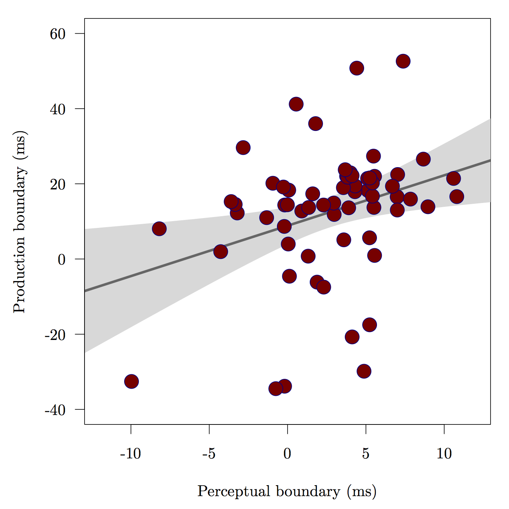

## Introduction

### Motivation

- Explore *what* and *how much* adults are capable of learning in optimal conditions 
context.
- Explore relationship between production/perception in early stages of L2 acquisition

---

## Introduction 

### Rationale

>- Sequential language learning has phonetic consequences (e.g. 
Flege et al., 1997; Pallier et al., 1997; Sebastián-Gallés & Soto-Faraco, 1999; 
among many others)
- Non-native accent retained, often after years of exposure to (and use of) L2
- Infants become 'attuned' to L1 sounds within first year of life (Bosch & Sebastián-Gallés, 2003; Kuhl et al., 1992)
- **Earlier is better**

---

## Introduction

### Late learners

>- L1/L2 cross-language interaction research suggests that native-like L2 ultimate 
attainment is difficult/uncommon
  - For both production/perception
  - Early sequential bilinguals (Pallier, Bosch, & Sebastián-Gallés, 1997; Sebastián-Gallés, Echeverría, & Bosch, 2005, among others)
- Grim outlook for most late learners (with exceptions) if native-like ultimate attainment is goal

---

## Introduction

### Advanced late learners

>- Some late learners do appear to be native-like, at least in some respects (Bongaerts, 1999)
- Multiple factors appear to be correlated with L2 mastery (Bongaerts, 1999)
  - Exposure to native input
  - Motivation
  - Phonetic/perceptual training
- Research by Flege suggests that native-like abilities associated with...
  - AOA/AOL
  - LOR
  - Access to native input
  - **L1**/**L2 use**

---

  

---

   

  

 
>- Accurately acquiring the stop contrasts of a foreign language can significantly improve foreign accent ratings (Sundara, Polka, & Baum, 2006)

---

## Introduction

### Research Questions

>1. Do LLs learn to produce and **perceive** the fine phonetic detail of Spanish stop contrasts after a short-term immersion program?
2. What is the nature of the representations of the L2 sounds acquired in this context?
3. Do LLs shift between language specific perceptual systems?

--- .segue bg:lightblue

<!-- 
#~~~~~~~~~~~~~~~~~~~~~~~~~~~#
# Overview                  #
#~~~~~~~~~~~~~~~~~~~~~~~~~~~#
-->

## Overview

 

1. Method
2. Production
3. Perception
4. Production/perception interface
5. Discussion/conclusion

--- .segue bg:grey

# Method

<!-- 
#~~~~~~~~~~~~~~~~~~~~~~~~~~~#
# Method                    #
#~~~~~~~~~~~~~~~~~~~~~~~~~~~#
-->

--- 

## Method

### Materials

- Demographic questionnaire 
- Assessment questionnaire
- Bilingual Language Profile

---

## Method

### Participants

- Late learners (LL, n = 10)
- Simultaneous bilinguals (BI, n = 10)

---

  

---

 

  

--- .segue bg:grey

# Production

<!-- 
#~~~~~~~~~~~~~~~~~~~~~~~~~~~#
# Production                #
#~~~~~~~~~~~~~~~~~~~~~~~~~~~#
-->

---

## Overview

1. Longitudinal development of stop production
2. Semantic processing

---

## Method

1. one
2. two

---

  

--- .segue bg:black

# Experiment 1
           
**Longitudinal development of stop production**

---

## Method

- one
- two [@praat]

---

## Results

- One
- Two

--- &twocol2 w1:60% w2:40%

*** {name: left}

  

*** {name: right}

- Aspiration decreases as a function of time for voiceless stops
- Pre-voicing is incorporated into production of voiced stops

--- .segue bg:black

# Experiment 2
           
**Semantic processing affects phonetic processing**

---

## Method

- one 
- two 

---

## Results

- one 
- two 

---

  

---

## Summary of findings

- one
- two

--- .segue bg:grey

# Perception

<!-- 
#~~~~~~~~~~~~~~~~~~~~~~~~~~~#
# Perception                #
#~~~~~~~~~~~~~~~~~~~~~~~~~~~#
-->

---

## Overview

1. Longitudinal development of stop perception
2. Double perceptual boundaries in late learners

---

## Method

### Stimuli

1. one
2. two

---

   

  

--- .segue bg:black

# Experiment 1
           
**Longitudinal development of stop perception**

---

## Method

- one
- two 

---

## Results

  

--- .segue bg:black

# Experiment 2
           
**Double perceptual boundaries**

---

## Method

- one 
- two 

--- 

## Results

  

---

## Summary of findings

- one
- two

--- .segue bg:grey

# Production and perception

<!-- 
#~~~~~~~~~~~~~~~~~~~~~~~~~~~#
# Prod/perc                 #
#~~~~~~~~~~~~~~~~~~~~~~~~~~~#
-->

---

## Overview

- one 
- two 

---

## Method

- one
- two

---

## Results

  

--- &twocol2 w1:40% w2:60%

*** {name: left}

- One 
- two

*** {name: right}

  

--- .segue bg:grey

# Discussion and conclusion

<!-- 
#~~~~~~~~~~~~~~~~~~~~~~~~~~~#
# Discussion/conclusion     #
#~~~~~~~~~~~~~~~~~~~~~~~~~~~#
-->

---

## Summary of findings

- one
- two 

---

## Discussion

- one 
- two 

---

## Conclusion

- one
- two 

--- &twocol

## Thank you

 

*** {name: left}

  <!--  -->
   
  <!--  -->
  <!--  -->
  

Comanche Nation   
Higher Education Grant

*** {name: right}

  
  

GPSC Research and Project Grant   
<code>RSRCH-702FY'15</code>

---

<!-- 
#~~~~~~~~~~~~~~~~~~~~~~~~~~~#
# References                #
#~~~~~~~~~~~~~~~~~~~~~~~~~~~#
-->

## References

