## Introduction

### Motivation

- Explore *what* and *how much* adults are capable of learning in optimal conditions 
- Explore relationship between production/perception in early stages of L2 acquisition
- Explore how L2 categories develop over time

*** pnotes

- This project is concerned with the acquisition of second language phonology. 

---

## Introduction 

### Rationale

>- Sequential language learning has phonetic consequences (e.g. 
Flege et al., 1997; Pallier et al., 1997; Sebastián-Gallés & Soto-Faraco, 1999; 
among many others)
- Non-native accent retained, often after years of exposure to (and use of) L2
- Infants become 'attuned' to L1 sounds within first year of life (Bosch & Sebastián-Gallés, 2003; Kuhl et al., 1992, Werker & Tees, 1984)
- **Earlier is better**

---

## Introduction

### Late learners

>- Cross-linguistic influence research suggests that native-like L2 ultimate 
attainment is difficult/uncommon
  - For both production/perception
  - Early sequential bilinguals (Pallier, Bosch, & Sebastián-Gallés, 1997; Sebastián-Gallés, Echeverría, & Bosch, 2005, among others)
- Grim outlook for most late learners (with exceptions) if native-like ultimate attainment is goal

---

## Introduction

### Advanced late learners

>- Some late learners do appear to be native-like, at least in some respects (Bongaerts, 1999)
- Multiple factors appear to be correlated with L2 mastery (Bongaerts, 1999)
  - Exposure to native input
  - Motivation
  - Phonetic/perceptual training
- Research by Flege suggests that native-like abilities associated with...
  - AOA/AOL
  - LOR
  - Access to native input
  - **L1**/**L2 use**

---

## Introduction

### L2 learning models

> - Speech Learning Model (SLM, Flege, 1995)
  - L1/L2 share same phonetic space, interact with each other
  - Novel sounds perceived based on approximations to native sounds
- Second Language Linguistic Perception Model (L2LP, Escudero, 2005)
  - L2 is copy of L1
  - Develops independently via GLA

</br>

> - <blue>Both models maintain that learning is possible in adults</blue>
- <blue>Strong production/perception link</blue>

*** pnotes

- SLM deals with segments
- L2LP deals with contrasts
  - new scenario (new category formation), similar scenario (boundary resetting)

---

<div align="center">
  
</div>

---

</br></br></br>
<div align="center">
  
</div>

</br>

>- Accurately acquiring the stop contrasts of a foreign language can significantly improve foreign accent ratings (Sundara, Polka, & Baum, 2006)

*** pnotes

- the task of the L2 learner of Spanish is to associate short-lag VOT with Spanish voiceless /p, t, k/, 
- and create a new category altogether for lead VOT associated with voiced /b, d,
g/ in order to produce and perceive the Spanish stop contrasts accurately 

---

## Introduction

### Language acquisition contexts (Batstone, 2002)

> - *communicative context*: L2 learners use the TL in order to exchange information
> - <BLUE>learning context</BLUE>: input generally comes from a teacher, with special emphasis placed on attention to form (e.g. traditional classroom)
> - **immersion context** (e.g. study abroad, domestic immersion)

*** pnotes

- CC = often immigrants that are confronted with the task of learning the majority language in their linguistic environment. 
- LC = The latter group typically consists of high school or college students taking a foreign language class for credit towards a diploma or a degree. 
- SA = naturalistic communicative context with the added benefit of explicit instruction in a learning context.
- Classroom shows advantages for XXX
- SA shows advantages for XXX
- There is little work on acquisition of L2 phonology as a function of context
- This research aims to fill this gap

---

## Introduction

### Traditional classroom 

- Advantages: grammatical structure, morphosyntactic control^1
- L2 phonology?
  - Phonetic category development w/ explicit instruction (Zampini, 1998; 2001)

### Study abroad

- Advantages: oral proficiency, oral fluency, cognitive abilities^2
- L2 phonology?
  - Phonetic category development w/o explicit instruction (Stevens, 2001)

</br></br>

#### ^1 Collentine, 2004; Freed, 2004; DeKeyser, 1986  

#### ^2 Segalowitz, 2004a, b; García Amaya, 2012; Llanes, 2012; Lord, 2006

---

## Introduction

### Research Questions

>1. Do late learners produce and perceive the fine phonetic detail of Spanish stops after a short-term domestic immersion program?
2. At what point during the learning process do late learners begin to acquire a new, 
language-specific phonetic system? How much exposure is necessary for the acquisition 
of L2 fine phonetic detail?
3. What is the nature of the representations of the L2 sounds acquired in this context?
4. What is the temporal relationship between production and perception with regard 
to category formation? 
5. Do LLs shift between language specific perceptual systems?
6. What is the role of input with regard to accurately and efficiently acquiring a novel 
speech sound?

---

## Overview

</br>

### 1. Method
### 2. Production
### 3. Perception
### 4. Production/perception interface
### 5. Discussion/conclusion

--- .segue bg:grey


# Method

<!-- 
#~~~~~~~~~~~~~~~~~~~~~~~~~~~#
# Method                    #
#~~~~~~~~~~~~~~~~~~~~~~~~~~~#
-->

--- 

## Overview

### Participants

- Late learners (LL, n = 10)
- Simultaneous bilinguals (BI, n = 10)

### Questionnaires

- Demographic questionnaire (LL)
- Assessment questionnaire (LL)
- Bilingual Language Profile (BI)

### Experimental tasks

- Production (2)
- Perception (2)

---

## Domestic immersion program

### Middlebury College Language Schools

>- 7 week Summer immersion program (Middlebury, VT)
- Language Pledge
  - Formal agreement between the program and the student by which 
  the student promises to use only the target language throughout 
  the duration of the program.
  - Prohibits students from using English—or any language apart 
  from the one they are studying—for the course of the program.
- Live in residence halls with other students/professors/bilingual assistants.
- Everything in target language.

---

## Participants

### Late learners (LL)

>- 10 functionally monolingual American English speakers (4 males, 6 females)
- age: 23.7 y/o (sd = 5.27)
- Completed a demographic questionnaire describing their previous experience with Spanish.
- More than the equivalent of one semester of Spanish = excluded
- From all over the United States 
- Participated in 7-week domestic immersion Spanish program

---

## Questionnaires

### Demographic questionnaire

- Administered on 1st day through google forms
- Age, sex, language history, travel history, parents languages, Spanish level

### Assessment questionnaire

- Administered at the beginning of every experimental session
- Self-reported...
  - time spent speaking Spanish/English
  - time spent speaking native/non-native speakers
  - speaking, listening and overall level in Spanish
  - sense of improvement
  - satisfaction with Spanish abilities
  - extracurricular activity participation

---

## Late learners

</br>

<div align="center">
  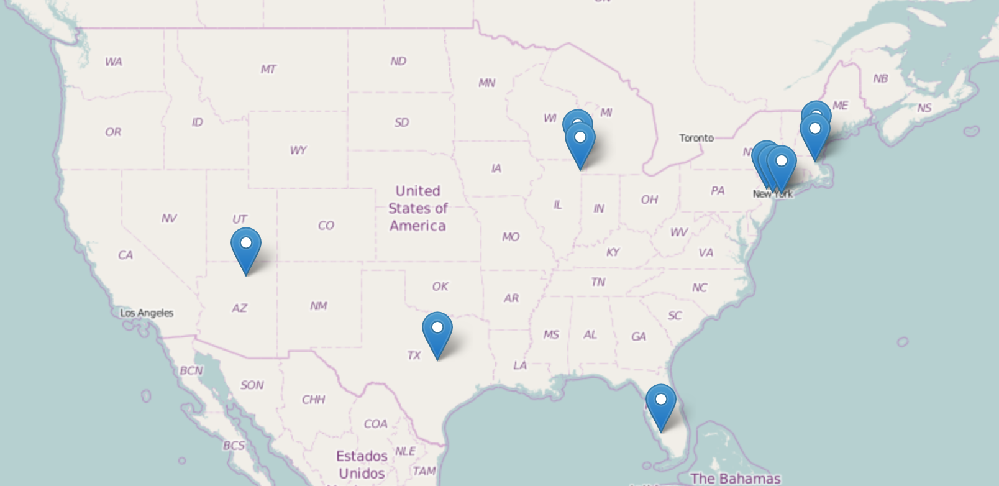
</div>

---

<div align="center">
  
</div>

*** pnotes

- week 0 assessment all participants reported using Spanish 0% of the time and English 100% 
- LLs used English minimally, roughly 13.5% of the time  
- LLs reported interacting with native speakers 40.5% of the time, and with more proficient NNS 65.5% of the time.
- the LL group received high amounts of L2 input (though not entirely native input), and reported minimal L1 use. The weekly percentages for each participant are available in Appendix A.0.4. The LL groups self assessments of listening, speaking, and overall ability improved with increased exposure to Spanish. For example, on the first day of the program the LLs rated their speaking abilities as a 2.7 out of 10. After the final assessment this rating had increased to 5.4 out of 10. Figure 2.1 displays a radar plot summarizing the assessment data over the course of the program.

---

<div align="center">

<!-- MotionChart generated in R 3.2.4 by googleVis 0.5.10 package -->
<!-- Sun May  8 21:06:03 2016 -->


<!-- jsHeader -->
<script type="text/javascript">
 
// jsData 
function gvisDataMotionChartID5c78a5c0a2f () {
var data = new google.visualization.DataTable();
var datajson =
[
 [
 "useSpan",
new Date(2015,5,25),
0,
0 
],
[
 "useSpan",
new Date(2015,6,1),
1,
91 
],
[
 "useSpan",
new Date(2015,6,8),
2,
87 
],
[
 "useSpan",
new Date(2015,6,15),
3,
87 
],
[
 "useSpan",
new Date(2015,6,22),
4,
88 
],
[
 "useSpan",
new Date(2015,6,29),
5,
89 
],
[
 "useSpan",
new Date(2015,7,5),
6,
88 
],
[
 "useEng",
new Date(2015,5,25),
0,
100 
],
[
 "useEng",
new Date(2015,6,1),
1,
11 
],
[
 "useEng",
new Date(2015,6,8),
2,
11 
],
[
 "useEng",
new Date(2015,6,15),
3,
15 
],
[
 "useEng",
new Date(2015,6,22),
4,
10 
],
[
 "useEng",
new Date(2015,6,29),
5,
11 
],
[
 "useEng",
new Date(2015,7,5),
6,
23 
],
[
 "speak",
new Date(2015,5,25),
0,
27 
],
[
 "speak",
new Date(2015,6,1),
1,
38 
],
[
 "speak",
new Date(2015,6,8),
2,
42 
],
[
 "speak",
new Date(2015,6,15),
3,
46 
],
[
 "speak",
new Date(2015,6,22),
4,
55 
],
[
 "speak",
new Date(2015,6,29),
5,
53 
],
[
 "speak",
new Date(2015,7,5),
6,
54 
],
[
 "understand",
new Date(2015,5,25),
0,
49 
],
[
 "understand",
new Date(2015,6,1),
1,
57 
],
[
 "understand",
new Date(2015,6,8),
2,
60 
],
[
 "understand",
new Date(2015,6,15),
3,
58 
],
[
 "understand",
new Date(2015,6,22),
4,
61 
],
[
 "understand",
new Date(2015,6,29),
5,
66 
],
[
 "understand",
new Date(2015,7,5),
6,
67 
],
[
 "overall",
new Date(2015,5,25),
0,
35 
],
[
 "overall",
new Date(2015,6,1),
1,
47 
],
[
 "overall",
new Date(2015,6,8),
2,
49 
],
[
 "overall",
new Date(2015,6,15),
3,
51 
],
[
 "overall",
new Date(2015,6,22),
4,
52 
],
[
 "overall",
new Date(2015,6,29),
5,
55 
],
[
 "overall",
new Date(2015,7,5),
6,
58 
] 
];
data.addColumn('string','var');
data.addColumn('date','date');
data.addColumn('number','week');
data.addColumn('number','value');
data.addRows(datajson);
return(data);
}
 
// jsDrawChart
function drawChartMotionChartID5c78a5c0a2f() {
var data = gvisDataMotionChartID5c78a5c0a2f();
var options = {};
options["width"] =   1000;
options["height"] =    600;
options["state"] = "\n{\"time\":\"2015-06-25\",\"sizeOption\":\"_UNISIZE\",\"duration\":{\"timeUnit\":\"D\",\"multiplier\":1},\"orderedByX\":true,\"iconType\":\"VBAR\",\"xZoomedIn\":false,\"yZoomedDataMax\":100,\"orderedByY\":false,\"yZoomedIn\":false,\"xLambda\":1,\"showTrails\":false,\"nonSelectedAlpha\":0.4,\"xAxisOption\":\"_ALPHABETICAL\",\"yZoomedDataMin\":0,\"uniColorForNonSelected\":false,\"colorOption\":\"_UNIQUE_COLOR\",\"dimensions\":{\"iconDimensions\":[\"dim0\"]},\"playDuration\":15000,\"yLambda\":1,\"xZoomedDataMin\":0,\"xZoomedDataMax\":5,\"yAxisOption\":\"3\",\"iconKeySettings\":[{\"key\":{\"dim0\":\"speak\"}},{\"key\":{\"dim0\":\"overall\"}},{\"key\":{\"dim0\":\"useEng\"}},{\"key\":{\"dim0\":\"understand\"}},{\"key\":{\"dim0\":\"useSpan\"}}]}\n";

    var chart = new google.visualization.MotionChart(
    document.getElementById('MotionChartID5c78a5c0a2f')
    );
    chart.draw(data,options);
    

}
  
 
// jsDisplayChart
(function() {
var pkgs = window.__gvisPackages = window.__gvisPackages || [];
var callbacks = window.__gvisCallbacks = window.__gvisCallbacks || [];
var chartid = "motionchart";
  
// Manually see if chartid is in pkgs (not all browsers support Array.indexOf)
var i, newPackage = true;
for (i = 0; newPackage && i < pkgs.length; i++) {
if (pkgs[i] === chartid)
newPackage = false;
}
if (newPackage)
  pkgs.push(chartid);
  
// Add the drawChart function to the global list of callbacks
callbacks.push(drawChartMotionChartID5c78a5c0a2f);
})();
function displayChartMotionChartID5c78a5c0a2f() {
  var pkgs = window.__gvisPackages = window.__gvisPackages || [];
  var callbacks = window.__gvisCallbacks = window.__gvisCallbacks || [];
  window.clearTimeout(window.__gvisLoad);
  // The timeout is set to 100 because otherwise the container div we are
  // targeting might not be part of the document yet
  window.__gvisLoad = setTimeout(function() {
  var pkgCount = pkgs.length;
  google.load("visualization", "1", { packages:pkgs, callback: function() {
  if (pkgCount != pkgs.length) {
  // Race condition where another setTimeout call snuck in after us; if
  // that call added a package, we must not shift its callback
  return;
}
while (callbacks.length > 0)
callbacks.shift()();
} });
}, 100);
}
 
// jsFooter
</script>
 
<!-- jsChart -->  
<script type="text/javascript" src="https://www.google.com/jsapi?callback=displayChartMotionChartID5c78a5c0a2f"></script>
 
<!-- divChart -->
  
<div id="MotionChartID5c78a5c0a2f" 
  style="width: 1000; height: 600;">
</div>

</div>

---

## Participants

### Simultaneous (native) bilinguals

- Control group
- Simultaneous Spanish/English bilinguals (n = 10) 
- Raised in Tucson, Arizona 
- Age: 23.3 (2.91)
- Use Spanish at home and with friends.
- Consider themselves fluent in both languages.
- Langauge dominance questionnaire (BLP)

---

## BLP (Birdsong, Amengual, Gertken, 2012)

- Bilingual Language Profile has four components: 
    - history (6 questions)
    - use (5 questions) 
    - competency (4 questions) 
    - attitudes (4 questions)
- Responses are numeric
    - score assigned to each language
        - Negative values = dominant in English 
        - Positive values = dominant in Spanish
        - Values close to 0 indicate balanced bilingualism 
        (mean = **7.63**; SD = **19.07**)

---

</br>
<div align="center">
  
</div>

---

## Tasks

- Production
  - Shadowing/Visual word recall administered weekly
  - Visual picture recall: administered post program
- Perception
  - 2AFC (a): ba/pa administered weekly
  - 2AFC (b): bafri/pafri administered post program in two sessions
- Metrics
  - **VOT**
  - Response accuracy
  - burst properties
  - vowel formants

---

## Experimental design

<p></p>
<div align="center">
  
</div>

--- .segue bg:grey


# Production

<!-- 
#~~~~~~~~~~~~~~~~~~~~~~~~~~~#
# Production                #
#~~~~~~~~~~~~~~~~~~~~~~~~~~~#
-->

---

## Overview

1. Longitudinal development of L2 stop production
  - Examine ongoing development of Spanish stop production in adult learners of Spanish
  - Focus on how production of stop voicing changed over the course of a domestic immersion program.
2. Effects of semantic processing on stop production
  - Utilized picture naming task to determine if late learners' phonetic processing was influenced by semantic processing when producing Spanish stops.

---

## General method

### Recordings

- Quiet room (LL) or sound attenuated booth (BI)
- Shure SM10A dynamic head-mounted microphone
- Sound Devices MM-1 microphone pre-amplifier
- Marantz PMD661 MKII Solid State Recorder
- Metric = VOT

### Participants

- LL (n = 10)
- BI (n = 10)

---

<div align="center">
  
</div>

--- .segue bg:black


# Experiment 1
</br></br></br></br></br></br></br></br></br></br></br>
**Longitudinal development of L2 stop production**

---

## Method

<div style="float:right">
  
   </br>
  </br>  
   </br>
  </br> 
   </br>
  </br> 
</div>

### Word list

- Spanish stops /p, t, k, b, d, g/ in utterance initial position
- Initial stop followed by one of five Spanish vowels and voiceless velar (i.e. /ˈbi.ki/, /ˈbe.ke/, /ˈba.ka/, /ˈbo.ko/, /ˈbu.ku/)
- 30 target productions, 20 distractors (included target words for prod. exp. 2)
- 3 repetitions = 90 tokens per session, 8 sessions = 720 tokens per participant
- Session 0 = delayed repetition
- Sessions 1-6 = reading
- Audio recordings produced by native Spanish speaker (Cádiz, Spain)

<audio controls>
  <source src="./assets/img/prod/piki.ogg" type="audio/ogg">
  <source src="./assets/img/prod/piki.wav" type="audio/mpeg">
  Your browser does not support the audio element.
</audio>

---

## Method

### Analyses: General Linear Mixed Effects Models\*

> 1. Did the LL group improve their production of Spanish stops after a 7-week 
immersion program?
  - Data from session 0 and session 6
  - ```VOT ~ session * voicing * poa * vheight```
2. When did learning occur over the course of the program?
  - Data from session 0 through session 6
  - Individual model for each stop
  - ```VOT ~ session (0:6) * vheight```
3. How did the LLs compare to a group of simultaneous bilinguals?
  - Data from LL session 6
  - ```VOT ~ group * voicing * poa * vheight```

<p></p>

#### \*All models include a maximal error term (Barr et al., 2013)

--- &twocol2 w1:60% w2:40%

*** {name: left}

<div style="float:left">
  
</div>

*** {name: right}

> - Aspiration decreases as a function of time for voiceless stops
- Pre-voicing is incorporated into production of voiced stops

---

<div align="center">

<!-- MotionChart generated in R 3.2.4 by googleVis 0.5.10 package -->
<!-- Sun May  8 21:07:52 2016 -->


<!-- jsHeader -->
<script type="text/javascript">
 
// jsData 
function gvisDataMotionChartID5c78e491b0e () {
var data = new google.visualization.DataTable();
var datajson =
[
 [
 "b",
new Date(2015,5,25),
"bilabial",
"voiced",
0,
-83.58726667,
13.54186667 
],
[
 "b",
new Date(2015,6,1),
"bilabial",
"voiced",
1,
-83.58726667,
11.11302013 
],
[
 "b",
new Date(2015,6,8),
"bilabial",
"voiced",
2,
-83.58726667,
8.299466667 
],
[
 "b",
new Date(2015,6,15),
"bilabial",
"voiced",
3,
-83.58726667,
-17.15060811 
],
[
 "b",
new Date(2015,6,22),
"bilabial",
"voiced",
4,
-83.58726667,
-19.14965753 
],
[
 "b",
new Date(2015,6,29),
"bilabial",
"voiced",
5,
-83.58726667,
-16.5652 
],
[
 "b",
new Date(2015,7,5),
"bilabial",
"voiced",
6,
-83.58726667,
-24.94806667 
],
[
 "p",
new Date(2015,5,25),
"bilabial",
"voiceless",
0,
16.5562,
32.06493333 
],
[
 "p",
new Date(2015,6,1),
"bilabial",
"voiceless",
1,
16.5562,
34.65586667 
],
[
 "p",
new Date(2015,6,8),
"bilabial",
"voiceless",
2,
16.5562,
28.56726667 
],
[
 "p",
new Date(2015,6,15),
"bilabial",
"voiceless",
3,
16.5562,
23.2006 
],
[
 "p",
new Date(2015,6,22),
"bilabial",
"voiceless",
4,
16.5562,
19.91805369 
],
[
 "p",
new Date(2015,6,29),
"bilabial",
"voiceless",
5,
16.5562,
22.46366667 
],
[
 "p",
new Date(2015,7,5),
"bilabial",
"voiceless",
6,
16.5562,
21.40168919 
],
[
 "d",
new Date(2015,5,25),
"coronal",
"voiced",
0,
-84.46831081,
16.7942 
],
[
 "d",
new Date(2015,6,1),
"coronal",
"voiced",
1,
-84.46831081,
15.78466667 
],
[
 "d",
new Date(2015,6,8),
"coronal",
"voiced",
2,
-84.46831081,
11.8766 
],
[
 "d",
new Date(2015,6,15),
"coronal",
"voiced",
3,
-84.46831081,
-14.91646667 
],
[
 "d",
new Date(2015,6,22),
"coronal",
"voiced",
4,
-84.46831081,
-18.98526667 
],
[
 "d",
new Date(2015,6,29),
"coronal",
"voiced",
5,
-84.46831081,
-14.41436242 
],
[
 "d",
new Date(2015,7,5),
"coronal",
"voiced",
6,
-84.46831081,
-14.6588 
],
[
 "t",
new Date(2015,5,25),
"coronal",
"voiceless",
0,
14.85446667,
33.75666667 
],
[
 "t",
new Date(2015,6,1),
"coronal",
"voiceless",
1,
14.85446667,
40.28726667 
],
[
 "t",
new Date(2015,6,8),
"coronal",
"voiceless",
2,
14.85446667,
27.37233333 
],
[
 "t",
new Date(2015,6,15),
"coronal",
"voiceless",
3,
14.85446667,
27.7033557 
],
[
 "t",
new Date(2015,6,22),
"coronal",
"voiceless",
4,
14.85446667,
23.8824 
],
[
 "t",
new Date(2015,6,29),
"coronal",
"voiceless",
5,
14.85446667,
26.26246667 
],
[
 "t",
new Date(2015,7,5),
"coronal",
"voiceless",
6,
14.85446667,
23.58126667 
],
[
 "g",
new Date(2015,5,25),
"velar",
"voiced",
0,
-69.93729167,
27.35986667 
],
[
 "g",
new Date(2015,6,1),
"velar",
"voiced",
1,
-69.93729167,
24.94234899 
],
[
 "g",
new Date(2015,6,8),
"velar",
"voiced",
2,
-69.93729167,
20.8038255 
],
[
 "g",
new Date(2015,6,15),
"velar",
"voiced",
3,
-69.93729167,
-2.068791946 
],
[
 "g",
new Date(2015,6,22),
"velar",
"voiced",
4,
-69.93729167,
-8.368933333 
],
[
 "g",
new Date(2015,6,29),
"velar",
"voiced",
5,
-69.93729167,
-4.96 
],
[
 "g",
new Date(2015,7,5),
"velar",
"voiced",
6,
-69.93729167,
-10.46624161 
],
[
 "k",
new Date(2015,5,25),
"velar",
"voiceless",
0,
31.16190476,
45.53893333 
],
[
 "k",
new Date(2015,6,1),
"velar",
"voiceless",
1,
31.16190476,
50.32826667 
],
[
 "k",
new Date(2015,6,8),
"velar",
"voiceless",
2,
31.16190476,
42.66326667 
],
[
 "k",
new Date(2015,6,15),
"velar",
"voiceless",
3,
31.16190476,
35.34926667 
],
[
 "k",
new Date(2015,6,22),
"velar",
"voiceless",
4,
31.16190476,
42.0052 
],
[
 "k",
new Date(2015,6,29),
"velar",
"voiceless",
5,
31.16190476,
44.77486667 
],
[
 "k",
new Date(2015,7,5),
"velar",
"voiceless",
6,
31.16190476,
40.34966667 
] 
];
data.addColumn('string','phon');
data.addColumn('date','week');
data.addColumn('string','place');
data.addColumn('string','voicing');
data.addColumn('number','session');
data.addColumn('number','bi');
data.addColumn('number','midd');
data.addRows(datajson);
return(data);
}
 
// jsDrawChart
function drawChartMotionChartID5c78e491b0e() {
var data = gvisDataMotionChartID5c78e491b0e();
var options = {};
options["width"] =   1000;
options["height"] =    600;
options["state"] = "\n{\"time\":\"2015-06-25\",\"dimensions\":{\"iconDimensions\":[\"dim0\"]},\"playDuration\":15000,\"yLambda\":1,\"orderedByY\":false,\"xZoomedDataMax\":6,\"orderedByX\":false,\"iconKeySettings\":[{\"trailStart\":\"2015-06-25\",\"key\":{\"dim0\":\"t\"}},{\"trailStart\":\"2015-06-25\",\"key\":{\"dim0\":\"b\"}},{\"trailStart\":\"2015-06-25\",\"key\":{\"dim0\":\"g\"}},{\"trailStart\":\"2015-06-25\",\"key\":{\"dim0\":\"k\"}},{\"trailStart\":\"2015-06-25\",\"key\":{\"dim0\":\"p\"}},{\"trailStart\":\"2015-06-25\",\"key\":{\"dim0\":\"d\"}}],\"duration\":{\"multiplier\":1,\"timeUnit\":\"D\"},\"sizeOption\":\"6\",\"xAxisOption\":\"4\",\"iconType\":\"BUBBLE\",\"xZoomedIn\":false,\"yZoomedDataMax\":50.32826667,\"yZoomedIn\":false,\"xLambda\":1,\"colorOption\":\"3\",\"nonSelectedAlpha\":0.4,\"yAxisOption\":\"6\",\"xZoomedDataMin\":0,\"yZoomedDataMin\":-24.94806667,\"showTrails\":true,\"uniColorForNonSelected\":false}\n";

    var chart = new google.visualization.MotionChart(
    document.getElementById('MotionChartID5c78e491b0e')
    );
    chart.draw(data,options);
    

}
  
 
// jsDisplayChart
(function() {
var pkgs = window.__gvisPackages = window.__gvisPackages || [];
var callbacks = window.__gvisCallbacks = window.__gvisCallbacks || [];
var chartid = "motionchart";
  
// Manually see if chartid is in pkgs (not all browsers support Array.indexOf)
var i, newPackage = true;
for (i = 0; newPackage && i < pkgs.length; i++) {
if (pkgs[i] === chartid)
newPackage = false;
}
if (newPackage)
  pkgs.push(chartid);
  
// Add the drawChart function to the global list of callbacks
callbacks.push(drawChartMotionChartID5c78e491b0e);
})();
function displayChartMotionChartID5c78e491b0e() {
  var pkgs = window.__gvisPackages = window.__gvisPackages || [];
  var callbacks = window.__gvisCallbacks = window.__gvisCallbacks || [];
  window.clearTimeout(window.__gvisLoad);
  // The timeout is set to 100 because otherwise the container div we are
  // targeting might not be part of the document yet
  window.__gvisLoad = setTimeout(function() {
  var pkgCount = pkgs.length;
  google.load("visualization", "1", { packages:pkgs, callback: function() {
  if (pkgCount != pkgs.length) {
  // Race condition where another setTimeout call snuck in after us; if
  // that call added a package, we must not shift its callback
  return;
}
while (callbacks.length > 0)
callbacks.shift()();
} });
}, 100);
}
 
// jsFooter
</script>
 
<!-- jsChart -->  
<script type="text/javascript" src="https://www.google.com/jsapi?callback=displayChartMotionChartID5c78e491b0e"></script>
 
<!-- divChart -->
  
<div id="MotionChartID5c78e491b0e" 
  style="width: 1000; height: 600;">
</div>

</div>

---

<div align="center">
  
</div>

*** pnotes

- Voiced segments clearly different, despite showing largest rate of change. 
- The voiceless stops were more native like, at least with regard to VOT.

---

## Summary of findings

- The LLs did improve their stop production in a 7-week immersion program
- Generally, learning took place after three weeks of exposure
- Some segments became more native-like than others

</br>

> - **What is the nature of the new sound representations?**
- **Are production gains still present in a more difficult task?**


--- .segue bg:black

# Experiment 2
</br></br></br></br></br></br></br></br></br></br></br>
**Effects of semantic processing on stop production**

---

## Background

- Semantic processing can affect production in L2 learners (Gustafson et al., 2013)
- Phonetic processing ('planning, programming, and execution of articulation') is susceptible to cross-linguistic influence because semantic processing activates L1 representations
- **Does semantic processing affect the production gains observed in the LL group?**

---

## Method

<div style="float:right">
  
   </br>
  </br>
   </br>
  </br>
  
</div>

### Procedure

- Picture naming task
- Participants said the word out loud upon recognizing it
- Instructed not to use definite article 

### Pictures

- 20 pictures, 12 included stop in word initial position
- Bisyllabic, paraxytone 
- Target segment followed by /a, o/

### Data

- VOT
- 12 target stops x 3 repetitions x 10 participants x 2 groups = 720 tokens

--- &twocol

*** {name: left}

Keywords

- **p**alo
- **p**olo
- <BLUE>b</BLUE>ala
- <BLUE>b</BLUE>ola
- **t**aco
- **t**opo
- <BLUE>d</BLUE>ado
- <BLUE>d</BLUE>odo
- **c**aca
- **c**oco
- <BLUE>g</BLUE>ato
- <BLUE>g</BLUE>ota

*** {name: right}

Distractors

- arbol
- lapiz
- libro
- manzana
- mochila
- silla
- sol
- sombrero

---

## Method 

### Analysis: GLMM

1. Does semantic processing affect stop production?
  - LL reading data from session 6
  - ```VOT ~ task * group * voicing * poa```

---

<div align="center">
  
</div>

---

</br></br>

<div align="center">
  
</div>

*** pnotes

- Bilinguals unaffected by semantic processing
- LL affected by semantic processing
  - mainly in voiceless stops
  - voiced stops have longer range (CLI = pre-voiced stops produced with short-lag VOT)

---

<div style="float:left">
  
</div>

---

## Summary of findings

- The LL group, but not the bilingual group, was affected by semantic processing
- L2 representations are susceptible to CLI during early stages of phonetic category formation

--- .segue bg:grey


# Perception

<!-- 
#~~~~~~~~~~~~~~~~~~~~~~~~~~~#
# Perception                #
#~~~~~~~~~~~~~~~~~~~~~~~~~~~#
-->

---

## Overview

1. Longitudinal development of stop perception (<BLUE>2AFC a</BLUE>)
  - How does LLs' perception the Spanish /b/-/p/ stop contrast change  
  as exposure to and use of Spanish increases?
2. Double perceptual boundaries in L2 learners (**2AFC b**)?
  - Do LLs develop a separate phonetic system for their L2, Spanish? 
  - If so, can they switch between Spanish and English systems depending  
  on the communicative context?

---

## General method

### Experimental paradigm

- Two-alternative forced-choice (2AFC) tasks
- Participants select identity of speech sound

### Stimuli

- Resynthesized VOT continua (-60 ms, 60 ms)
- 13 steps

### Participants

- LL (n = 10)
- BI (n = 10)

---

</br></br></br>
<div align="center">
  
</div>

--- .segue bg:black


# Experiment 1
</br></br></br></br></br></br></br></br></br></br></br>
**Longitudinal development of stop perception**

---

## Method

### Stimuli

- 25-year-old female bilingual English/Spanish speaker of the Southwestern U.S.
- Spanish 'palabra' used as base
- VOT manipulated in 10 ms increments to simulate both Spanish and English stop contrast systems
- 13-step /ba/-/pa/ continuum (-60 ms to 60 ms)

</br>

<audio controls>
  <source src="./assets/img/perc/00_pa_hybrid-60.ogg" type="audio/ogg">
  <source src="./assets/img/perc/00_pa_hybrid-60.wav" type="audio/mpeg">
  Your browser does not support the audio element.
</audio>

<audio controls>
  <source src="./assets/img/perc/12_pa_hybrid+60.ogg" type="audio/ogg">
  <source src="./assets/img/perc/12_pa_hybrid+60.wav" type="audio/mpeg">
  Your browser does not support the audio element.
</audio>

---

## Method

<div style="float:right">
  
  </br></br>
  
  </br></br>
  
  
</div>

### Procedure

- 2AFC (a) completed every Sunday (after assessment questionnaire) in quiet room
- Participants instructed to choose which sound—'ba' or 'pa'—they thought they had heard as quickly and as accurately as possible using DirectIN rotary controller 
- 'ba' and 'pa' appeared on screen as stimuli presented
- Practice session of 6 trials
- Stimuli from continuum presented 10 times (130 trials total) in 1 randomized block, ISI 500 ms. 
- Approximately 10 minutes

---

## Method

<div style="float:right">
  $log\frac{p}{1-p} = \alpha + \beta_1X_1 + \beta_2X_2 + ... + \beta_pX_p$
</div>

### Analyses 

<p></p>

1. Does LLs' perception of stops change over time?
  - ```response ~ session + VOT```
2. How do LLs compare with bilinguals?
  - Data from LLs (session 7) and BI
  - ```response ~ group * VOT```

</br>

- Contrast coefficient slopes: $\frac{\beta_0}{\beta_{VOT}} \times -1$
- 50% crossover points: $(\beta_0 \div \beta_1 X_1) \times -1$

---

</br></br>

<div align="center">
  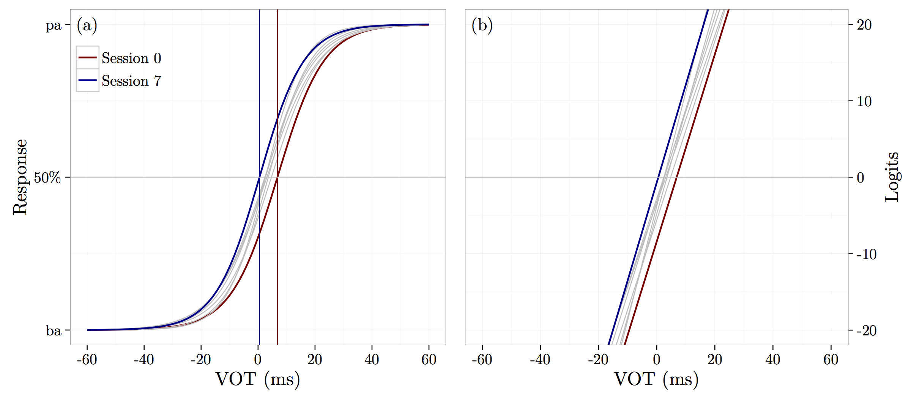
</div>

*** pnotes

- The cross over point decreased by 0.66 ms ± 0.29 (se) in each session (t(9) = -2.23; p < 0.03)

---

</br></br>

<div align="center">
  
</div>

*** pnotes

- The crossover point did not vary as a function of group (p > 0.05)

---

## Summary of findings

> - Does LLs' perception of stops change over time?
  - LLs responded /pa/ more often at end of immersion program.
  - In session 2 (after two weeks) responses significantly different from session 0.
- How do LLs compare with bilinguals?
  - At the end of the program their identification of the resynthesized continua is similar
  - Analysis suggests they vary slightly, but not regarding the phoneme boundary
  - Caution interpreting a null effect

</br>

> - **Can LLs shift between language-specific modes of perception?**

--- .segue bg:black


# Experiment 2
</br></br></br></br></br></br></br></br></br></br></br>
**Double perceptual boundaries in L2 learners?**

---

## Background

### Bilingual Language Modes (Grosjean, 1998)

>[...] state of activation of the bilingual's languages and language 
> processing mechanisms at a given point in time (Grosjean, 2002)

- Activation of languages increases/decreases as a function of communicative setting
  - Bilingual mode: both languages activated
  - Unilingual mode: one language activated
- Are perceptual expectations affected by language mode?

<p></p>

### Language set experiments

- 2AFC tasks given in different language environments
- Finding: bilinguals have two perceptual boundaries depending on language expectations 

---

</br></br>

<div align="center">
  
</div>

---

## Background

<div style="float:right">
  
</div>

### Gonzáles & Lotto (2013)

- Language modes are induced via stimuli:
  - 'Spanish' ba[fɾi]-pa[fɾi]
  - 'English' ba[fɹi]-pa[fɹi]
- Finding: Bilinguals have double perceptual boundary

</br>

> - **Do LLs have two perceptual boundaries depending on language expectations?**

--- &twocol

## Method

### Materials

- Female simultaneous bilingual speaker
  - ba/pa productions
  - 'fri' [fɾi] and [fɹi] productions
  - append lead voicing for /ba/, aspiration for /pa/ (Gonzales & Lotto, 2013)
- Two 13-step continua (-60ms to 60ms, 10ms increments)
  - 'Spanish' ba[fɾi]-pa[fɾi]
  - 'English' ba[fɹi]-pa[fɹi]


<p></p>

*** {name: left}

#### <div align="left">**English**: /ˈba.fɹi/ - /ˈpa.fɹi/</div>

<audio controls>
  <source src="./assets/img/perc/00_en_afri-60.ogg" type="audio/ogg">
  <source src="./assets/img/perc/00_en_afri-60.wav" type="audio/mpeg">
  Your browser does not support the audio element.
</audio>

<audio controls>
  <source src="./assets/img/perc/12_en_afri+60.ogg" type="audio/ogg">
  <source src="./assets/img/perc/12_en_afri+60.wav" type="audio/mpeg">
  Your browser does not support the audio element.
</audio>

*** {name: right}

#### <div align="left"><BLUE>Spanish</BLUE>: /ˈba.fɾi/ - /ˈpa.fɾi/</div>

<audio controls>
  <source src="./assets/img/perc/00_sp_afri-60.ogg" type="audio/ogg">
  <source src="./assets/img/perc/00_sp_afri-60.wav" type="audio/mpeg">
  Your browser does not support the audio element.
</audio>

<audio controls>
  <source src="./assets/img/perc/12_sp_afri+60.ogg" type="audio/ogg">
  <source src="./assets/img/perc/12_sp_afri+60.wav" type="audio/mpeg">
  Your browser does not support the audio element.
</audio>

--- 

## Method

<div style="float:right">
  
  </br></br>
  
  </br></br>
  
  
</div>

### Procedure

- Participants completed two 2AFC identification tasks
  - Session 1: Spanish - ba[fɾi]-pa[fɾi]
  - Session 2: English (24 hrs later) - ba[fɹi]-pa[fɹi]
- Language modes are induced via stimuli
- Practice session of 6 trials
- 10 repetitions (130 trials total) in 1 randomized block, ISI 500 ms
- Approximately 12 minutes

---

## Method

<div style="float:right">
  $log\frac{p}{1-p} = \alpha + \beta_1X_1 + \beta_2X_2 + ... + \beta_pX_p$
</div>

### Analyses: GLMM

<p></p>

- Does perception of stops vary as a function of language/group?
  - ```response ~ language * group * VOT```

</br>

- Contrast coefficient slopes: $\frac{\beta_0}{\beta_{VOT}} \times -1$
- 50% crossover points: $(\beta_0 \div \beta_1 X_1) \times -1$

---

</br></br>

<div align="center">
  
</div>

*** pnotes

- English-like stimuli produced an overall change in the log odds of voiceless responses (i.e. `pafri') of -0.56 ± 0.12 se (*z* = -4.61; p < 0.001)

---

## Summary of findings

### 2AFC (a)

- LLs group shifted their perceptual boundary after two weeks of exposure to Spanish (low L1 use/high TL use/input)
- Evidence for development of an L2-specific perceptual system/resetting of the perceptual boundary
- By the end of the 7-week immersion program, the perceptual boundary of the LL group was within the range of BI

### 2AFC (b)

- LL and BI groups had language-specific expectations for stop perception
- Both groups shifted their perceptual boundaries as a function of the language they thought they had heard
  - only difference between the stimuli was the realization of 'r'

*** pnotes

- replicates Gonz & Lotto 
  - with bilinguals (w/in subj design)
  - extends findings to L2 learners

--- .segue bg:grey


# Production/perception interface

<!-- 
#~~~~~~~~~~~~~~~~~~~~~~~~~~~#
# Prod/perc                 #
#~~~~~~~~~~~~~~~~~~~~~~~~~~~#
-->

---

## Background

> - Major theories of speech perception posit a relationship between perception and production
  - L1 acquisition (DRT, MT, GA) 
  - L2 acquisition (SLM, PAM-L2, NLM, L2LP)
- Chicken or the egg?
- **Perception precedes production in L2 learning**\*
  - Default assumption for most models
  - L2 phonetic segments are "[...] produced only as accurately as they are perceived" (Flege, 2003, p. 25).

</br></br></br>
#### \*Williams, 1979; Borden, 1983; Neufeld, 1988; Barry, 1989; Grasseger, 1991; Flege, 1993; Rochet, 1995; Llisterri, 1995; Flege, 1997; Leather, 1999

---

## Background

- Major theories of speech perception posit a relationship between perception and production
  - L1 acquisition (DRT, MT, GA) 
  - L2 acquisition (SLM, PAM-L2, NLM, L2LP)
- Chicken or the egg?
- **Production precedes perception in L2 learning**\*
  - Some L2 learners have poor discrimination and accurate production
  - May be due to focus on pronunciation in L2 classroom

</br></br></br></br>
#### \*Goto, 1971; Caramazza, 1973; Sheldon, 1982; Mack, 1989; Mathews, 1997; Leather, 1997; Wang, 2002; Kissling, 2014

---

## Escudero (2006)

</br>

>[...] these findings can be contested on the basis of a 
> number of methodological shortcomings such as the controlled nature of 
> the production tasks and the articulatory training undergone by the 
> learners, which elicit highly monitored and unnatural L2 productions, 
> as well as the problematic nature of their data analyses. Furthermore, 
> most of these studies report on perceptual findings that were conducted 
> within a bilingual language setting, which, according to psycholinguistic 
> evidence [...], results in the activation of two languages and, consequently, 
> in performance patterns intermediate between speaker's L1 and L2 that 
> would have not been found had the learners been in a monolingual L2 
> setting (p. 111).

---

## Overview

### Goals 

- Examine the production/perception relationship in adult L2 learners
  - Determine if there was a correlation between production gains and perceptual boundary shifts in LL group
  - Determine if perceptual learning preceded accurate production or *vice versa*

### Data

- Longitudinal production data and perception data analyzed together
  - Production: VOT from bilabial stops (7 sessions)
  - Perception: phoneme boundary from 2AFC (a) (8 sessions)

### Issues

- Data are unbalanced
- What is a production boundary?

---

## Method

<div style="float:right">
    $CO =  \frac{\beta_0}{\beta_{VOT}} \times -1$
</div>

### Metrics

- Phoneme boundaries
  - Production: mean VOT value for bilabial stops
  - Perception: crossover point from GLMM

### Analyses

1. Are production and perception related in L2 learners?
  - Correlation (descriptive)
2. In which modality does learning occur first?
  - 2 GLMs
  - Treatment coding (session 0 = reference)
  - Replicates production exp 1 and perception exp 1 with different DV
  - ```boundary ~ session```

---

</br>

<div align="center">
  
</div>

*** pnotes

- production boundary different from initial state after session 4 (week 3)
- Perception boundary different from initial state after session 3 (week 2)
- corroborates Exp 1 from prod/perc
- suggests perceptual learning occurred before production gains for bilabial stops

--- 

<div style="float:left">
  
</div>

*** pnotes

- as production boundary decreases over time, so does the perceptual boundary

--- .segue bg:grey


# Discussion and conclusion

<!-- 
#~~~~~~~~~~~~~~~~~~~~~~~~~~~#
# Discussion/conclusion     #
#~~~~~~~~~~~~~~~~~~~~~~~~~~~#
-->

---

## Summary of findings

### Assessment

- LL group used English minimally and Spanish almost exclusively
- TL input mainly from native speakers or non-native speakers with high levels of proficiency 
- Listening, speaking, and overall abilities in Spanish improved over the course of the program

</br>

### Production

- VOT values decreased over course of program
- Only /p, t/ within native range
- Production gains offset by semantic processing

---

## Summary of findings (cont.)

### Perception

- LLs modify their perception of stops after limited exposure to the TL by adopting language-specific perceptual strategies
- By the end of the program, LLs have language-specific expectations used for stop identification (double perceptual boundary)

</br>

### Production/perception interface

- Two modalities showed a decrease, or shift, in the phonetic category boundaries as exposure to and use of Spanish increased
- Perceptual boundary shifts occurred one session prior to the production boundary shifts
- Suggests that production and perception related in the beginning stages of L2 learning, and that phonetic learning is perceptually driven

---

## Discussion

### Longitudinal development of phonetic categories

- L2 phonetic category formation appears to occur **abruptly** and at an **early** stage of L2 learning, at least for stops
- Further development continues gradually as exposure to and use of the target language increase

*** pnotes

- parallel findings in Zampini (1998) for /b, p/
  - also saw improvement in prod/perc over course of semester
  - not clear if due to L2 use/input or explicit instruction regarding artic.
- corroborates research by Stevens (2001) for /p, t, k/
  - improvement over course of SA program, longer stay = better results
  - pre/post test design, so not clear when learning occurs
- Corroborates Williams (1979) re perceptual boundary shifts
  - learning occurs at early stage in development of PR children

---

## Discussion

### Early L2 representations

- Evidence suggesting that adult learners can develop an L2 perceptual system and may be capable of switching between this newly developed system and that of their L1 in a manner similar to that of native bilinguals
- Initial gains in early stages of L2 learning are **fragile**, particularly sensitive to cross-linguistic influence
- Cross-linguistic influence may diminish as proficiency in TL increases

*** pnotes

- Extends results of Gonzales & Lotto (2013) to L2 learners
- Corroborates findings from Gustafson (2013)
  - semantic processing affects phonetic processing
  - CLI may diminish as proficiency increases

---

## Discussion

### Learning context effects

- <blue>Traditional classroom</blue>
  - grammatical structure, morphosyntactic control
  - phonetic category development w/ explicit instruction
- **Study abroad</blue>**
  - oral proficiency, oral fluency, cognitive abilities
  - phonetic category development w/o explicit instruction

<p></p>

> - Domestic immersion
  - Same benefits as foreign immersion regarding L2 phonological acquisition
  - High input (different from SA?)
  - Advantage due to required TL use?

*** pnotes

- Best of both worlds?

---

## Discussion

### Second language acquisition and teaching

- TL use may be key in maximizing positive L2 outcomes related to accurate production and perception
- Present findings help inform language teachers regarding decisions related to balancing L1 and L2 use in the classroom

---

## Discussion

### Future research

- Phonetic drift?
- Extend to other speech segments
  - Spirantization (new allophonic distribution for L1 contrast)
  - Trills (altogether new phoneme)
- Replicate in L2 classroom and study abroad contexts
  - effects of L1/L2 use
  - relative importance of different types of TL input

---

## Conclusion

- The present investigation analyzed early second language learning in adults
- Contributes to our understanding of the acquisition of L2 phonectic categories
- The longitudinal data suggest that L2 phonetic category formation is abrupt, occurs at an early stage of development, and is perceptually driven
- Early L2 representations are fragile, and especially susceptible to cross-linguistic influence

--- &twocol

## Thank you

</br>

*** {name: left}

<div align='center'>
  <!--  -->
  </br>
  <!--  -->
  <!--  -->
  <p></p>
Comanche Nation </br></br>
Higher Education Grant

</div>

*** {name: right}

<div align='center'>
  
  <p></p>

GPSC Research and Project Grant </br></br>
<code>RSRCH-702FY'15</code>
</div>

---


<!-- 
#~~~~~~~~~~~~~~~~~~~~~~~~~~~#
# References                #
#~~~~~~~~~~~~~~~~~~~~~~~~~~~#
-->

## References

- Aoyama, K., Flege, J. E., Guion, S. G., Akahane-Yamada, R., & Yamada, T. (2004). Perceived phonetic dissimilarity and L2 speech learning: the case of Japanese /r/ and English /l/ and /r/. Journal of Phonetics, 32(2), 233–250.
- Best, C. T. (1995). A Direct Realist View of Cross-Language Speech Perception. In W. Strange (Ed.), Speech perception and linguistic experience: Issues in cross language research (pp. 171–204).
- Best, C. T., & Tyler, M. D. (2007). Nonnative and second-language speech perception. Amsterdam: John Benjamins Publishing Company.
- Bosch, L., & Ramon-Casas, M. (2011). Variability in vowel production by bilingual speakers: can input properties hinder the early stabilization of contrastive categories? Journal of Phonetics, 39(4), 514–526.
- Escudero, P., Benders, T., & Lipski, S. C. (2009). Native, non-native and L2 perceptual cue weighting for Dutch vowels: the case of Dutch, German, and Spanish listeners. Journal of Phonetics, 37(4), 452–465.

---

## References II

- Flege, J. E. (1995). Second language speech learning: Theory, findings, and problems. In W. Strange (Ed.), Speech perception and linguistic experience issues in cross-language research (pp. 229–273). Timonium, MD: York Press.
- Flege, J. E. (2012). The role of input in second language (L2) speech learning. In 11th international conference on native and non-native accents of english. Lodz, Poland.
- Flege, J. E., & MacKay, I. R. A. (2004). Perceiving vowels in a second language. Studies in Second Language Acquisition, 26(1), 1–34.
- Flege, J. E., Bohn, O.-S., & Jang, S. (1997). Effects of experience on non-native speakers’ production and perception of English vowels. Journal of Phonetics, 25(4), 437–470.
- Flege, J. E., MacKay, I. R. A., & Meador, D. (1999). Native Italian speakers’ perception and production of English vowels. The Journal of the Acoustical Society of America, 106(5), 2973–2987.

---

## References III

- Kondaurova, M. V., & Francis, A. L. (2008). The relationship between native allophonic experience with vowel duration and perception of the English tense/lax vowel contrast by Spanish and Russian listeners. The Journal of the Acoustical Society of America, 124(6), 3959–3971.
- Kondaurova, M. V., & Francis, A. L. (2010). The role of selective attention in the acquisition of English tense and lax vowels by native Spanish listeners: comparison of three training methods. Journal of Phonetics, 38(4), 569–587.
- Kuhl, P. K., Stevens, E., Hayashi, A., Deguchi, T., Kiritani, S., & Iverson, P. (2006). Infants show a facilitation effect for native language phonetic perception between 6 and 12 months. Developmental Science, 9(2), F13–F21.
- Kuhl, P. K., Williams, K. A., Lacerda, F., Stevens, K. N., & Lindblom, B. (1992). Linguistic experience alters phonetic perception in infants by 6 months of age. Science, 255(5044), 606–608.
- Lado, R. (1964). Languge teaching: a scientific approach. New York: McGraw Hill. Lenneberg, E. H. (1967). Biological foundations of language. New York: Wiley.

---

## References IV

- Lisker, L., & Abramson, A. S. (1964). A Cross-language Study of Voicing in Initial Stops: Acoustical Measurements. Word, 20.3, 384–422.
- Morrison, G. S. (2008). L1-Spanish speakers’ acquisition of the english /i/-/I/ contrast: duration-based perception is not the initial developmental stage. Language and Speech, 51(4), 285–315.
- Morrison, G. S. (2009). L1-Spanish speakers’ acquisition of the English /i/-/I/ contrast ii: perception of vowel inherent spectral change. Language and Speech, 52(4), 437–462.
- Pallier, C., Bosch, L., & Sebastián-Gallés, N. (1997). A limit on behavioral plasticity in speech perception. Cognition, 64(3), B9–17.
20
- Piske, T., Flege, J. E., MacKay, I. R. A., & Meador, D. (2002). The production of English vowels by fluent early and late Italian-English bilinguals. Phonetica, 59(1), 49–71.
- Sebastián-Gallés, N. (2006). Native-language sensitivities: evolution in the first year of life. Trends in Cognitive Sciences, 10(6), 239–241.

---

## References V

- Sebastián-Gallés, N., & Soto-Faraco, S. (1999). Online processing of native and non-native phonemic contrasts in early bilinguals. Cognition, 72(2), 111–123.
- Sebastián-Gallés, N., Echeverría, S., & Bosch, L. (2005). The influence of initial exposure on lexical representation: comparing early and simultaneous bilinguals. Journal of Memory and Language, 52(2), 240–255.
- Simonet, M. (2011). Production of a Catalan-specific vowel contrast by early Spanish-Catalan bilinguals. Phonetica, 68(1-2), 88–110.
- Strange, W. (2011). Automatic selective perception (ASP) of first and second language speech: A working model. Journal of Phonetics, 39(4), 456–466.
- Strange, W., & Shafer, V. L. (2008). Speech perception in second language learners: the re-education of selective perception. In Phonology and second language acquisition (pp. 153–186). Phonology; Second Language Acquisition.
- Sundara, M., Polka, L., & Baum, S. (2006). Production of coronal stops by simultaneous bilingual adults. Bilingualism: Language and Cognition, 9(01), 97–114.

---

## References VI

- Sundara, M., Polka, L., & Genesee, F. (2006). Language-experience facilitates discrimination of /d-/ in monolingual and bilingual acquisition of English. Cognition, 100(2), 369–388.
- Valdés, G. (2000a). Introduction. In *Spanish for native speakers*. AATSP professional development 
series handbook for teachers K-16, VOlume 1 (pp. 1-20). New York: Harcourt College.
- Valdés, G. (2000b). Teaching heritage languages: An introduction for Slavic-language-teaching 
professionals. In O. Kagen & B. Rifkin (Eds.), *Learning and teaching of Slavic languages 
and cultures: Toward the 21st century (pp. 375-403). Bloomington, IN: Slavica.
- Zampini, M. L. (1998). The Relationship between the Production and Perception of L2 Spanish Stops. Texas Papers in Foreign Language Education, 3(3), 85–100.
- Zampini, M. L., & Green, K. P. (2001). The voicing contrast in English and Spanish: The relationship between perception and production. In One mind, two languages bilingual language processing (pp. 23–48). Malden, Mass; Oxford: Blackwell.

--- .segue bg:pink


# Extras

---

## Domestic immersion program

<div align="center">
  
</div>

---

## Domestic immersion program

</br>

<div align="center">
  
</div>

---

### 00_prodGLMM1

<div align="center">
  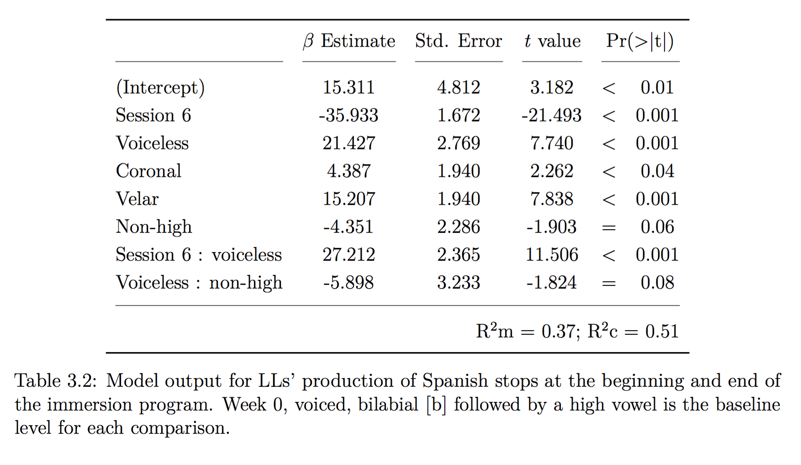
</div>

---

### 01_prodMULTcompLL

<div align="center">
  
</div>

---

### 02_prodCOMPbi

<div align="center">
  
</div>

---

### 03_prodMULTcompBI

<div align="center">
  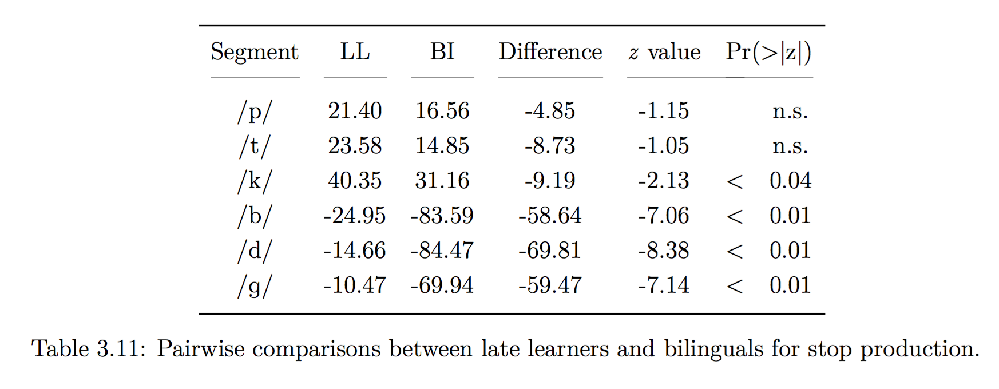
</div>

---

### 04_prodB

<div align="center">
  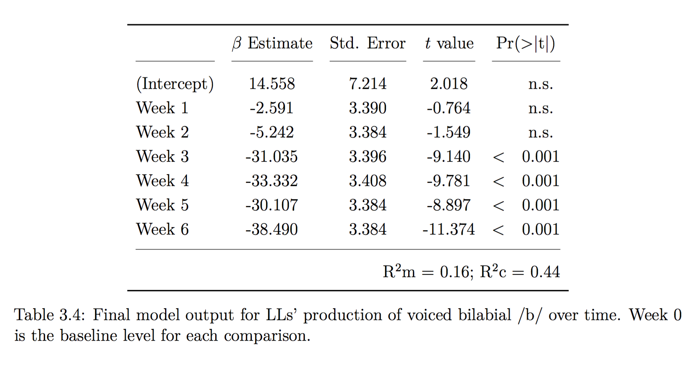
</div>

---

### 05_prodD

<div align="center">
  
</div>

---

### 06_prodG

<div align="center">
  
</div>

---

### 07_prodP

<div align="center">
  
</div>

---

### 08_prodT

<div align="center">
  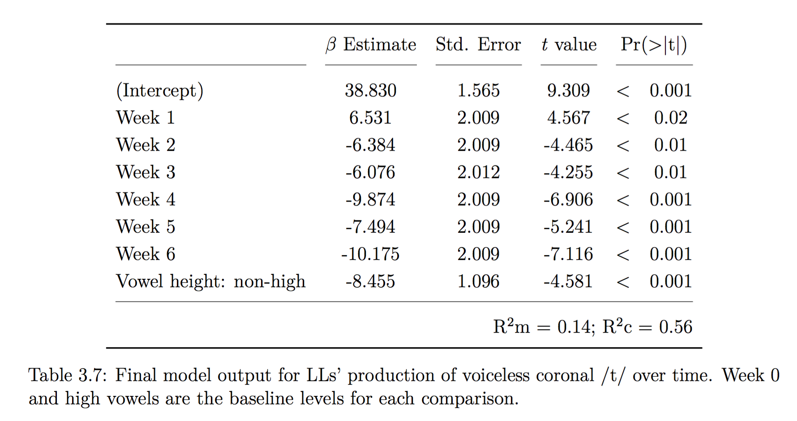
</div>

---

### 09_prodK

<div align="center">
  
</div>

---

### 10_prod2GLMM

<div align="center">
  
</div>

---

### 11_perc1GLMM

<div align="center">
  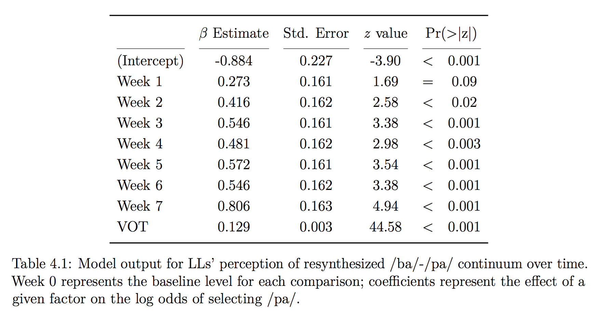
</div>

---

### 12_perc1RAW

<div align="center">
  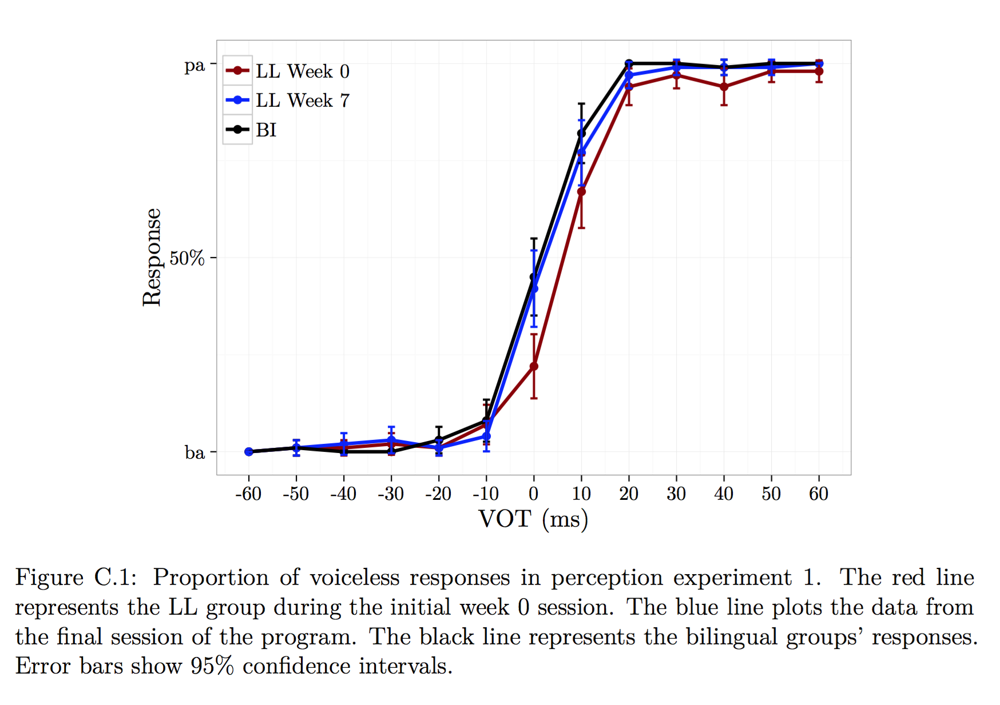
</div>

---

### 13_perc1COMPbi

<div align="center">
  
</div>

---

### 14_perc2GLMM

<div align="center">
  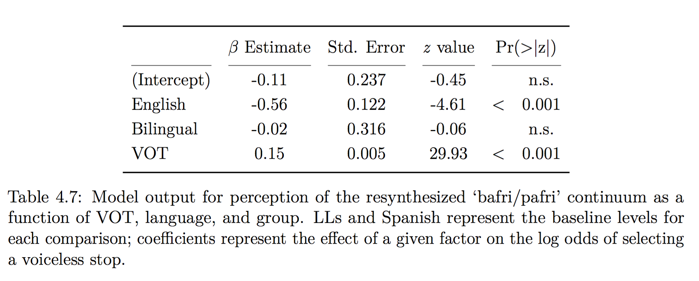
</div>

---

### 15_perc2RAW

<div align="center">
  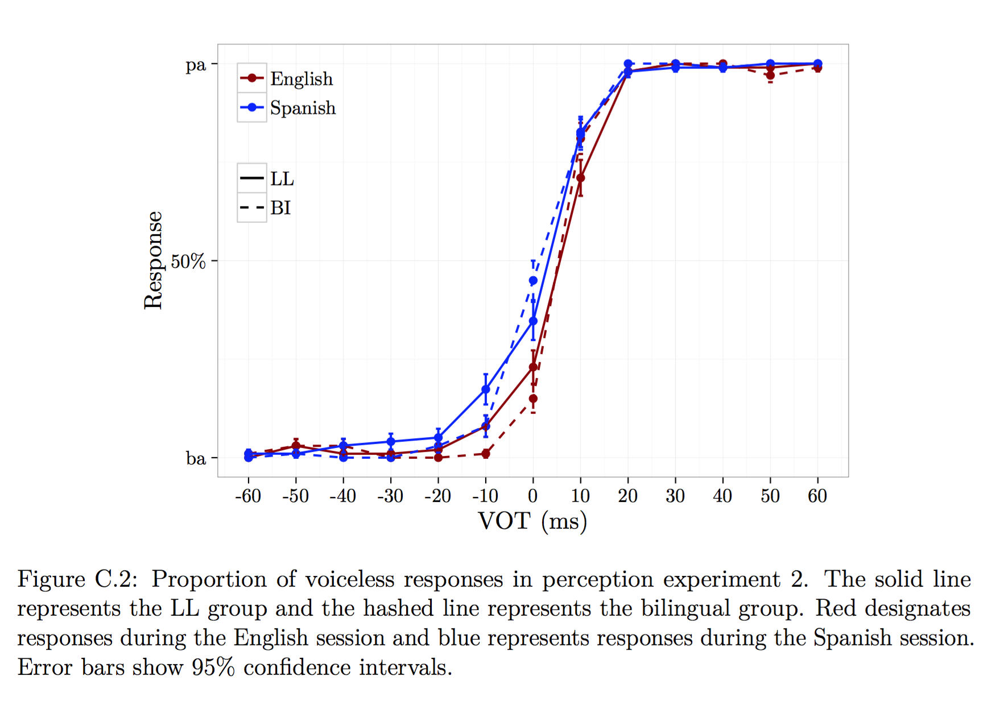
</div>

---

### 16_prodPercPROD

<div align="center">
  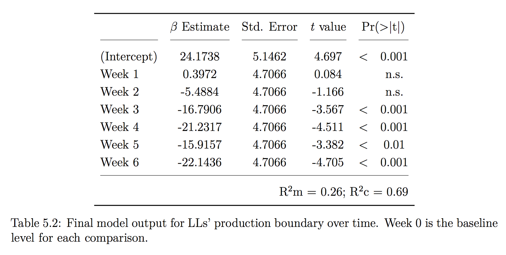
</div>

---

### 17_prodPercPERC

<div align="center">
  
</div>


